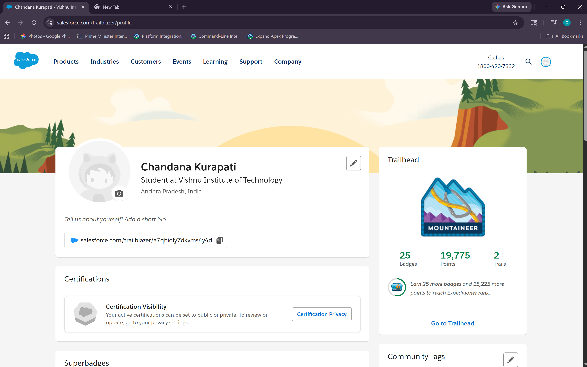

# Light Completion Day

## Modules Completed

1. Search Solution Basics  
2. Command Line Interface  
3. Agentforce 360 Platform Event Basics  

---

# One Learning From Each Module

## Search Solution Basics
I learned how Salesforce searches and retrieves records quickly using search functionality.

## Command Line Interface
I understood how CLI helps developers perform Salesforce tasks faster using commands instead of manual steps.

## Agentforce 360 Platform Event Basics
I learned how systems communicate using publish and subscribe events in Salesforce.

---

# One Doubt / Question

I still have a doubt about how subscribe events work internally and how the system automatically listens for published events.

---

# Trailhead Progress Screenshot

_Add your screenshot here_

```text
Example:

```

---
